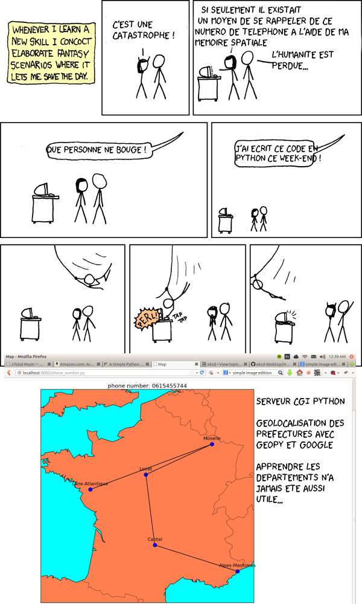

posts
=====

This is a sort of blog / work in progress repository for interesting projects that pop into my mind. Some of the posts get published on my blog: 

- blog: <http://flothesof.github.io/>
- blog repo (integrating the .ipynb posts): <https://github.com/flothesof/PelicanBlog>

Example of an idea for a project adapted as an XKCD comic:

